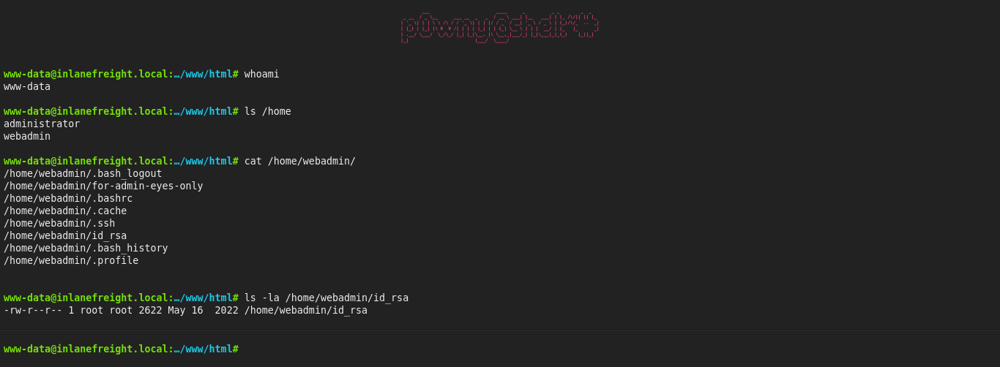
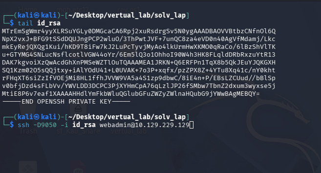
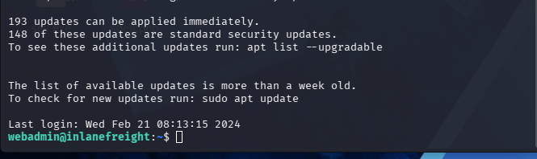
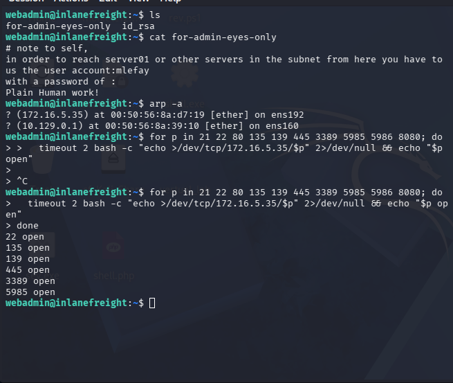
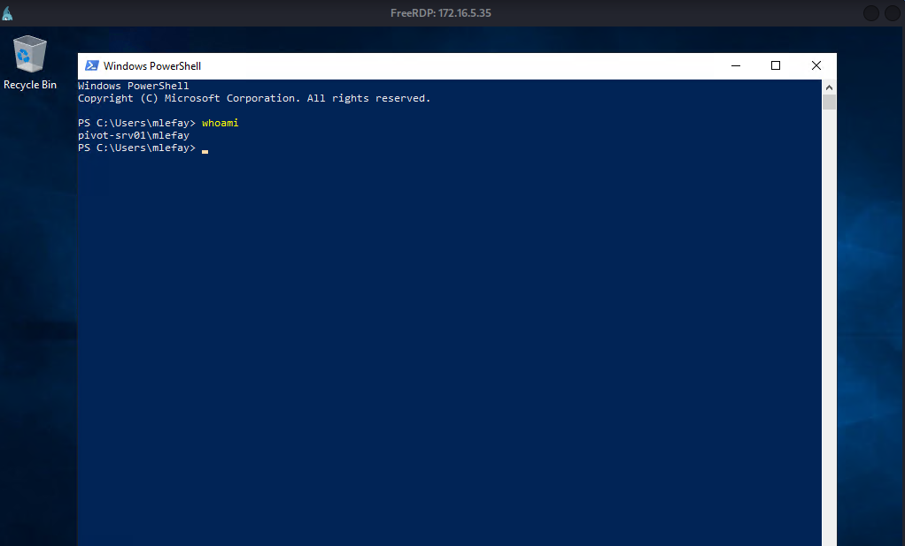
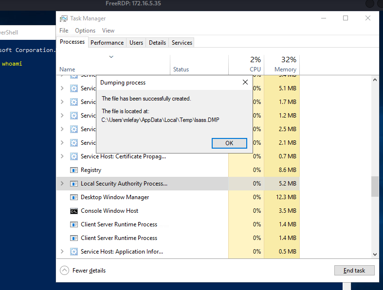
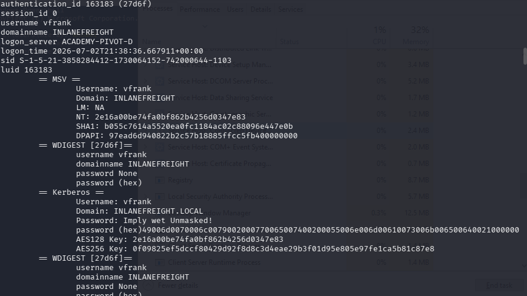
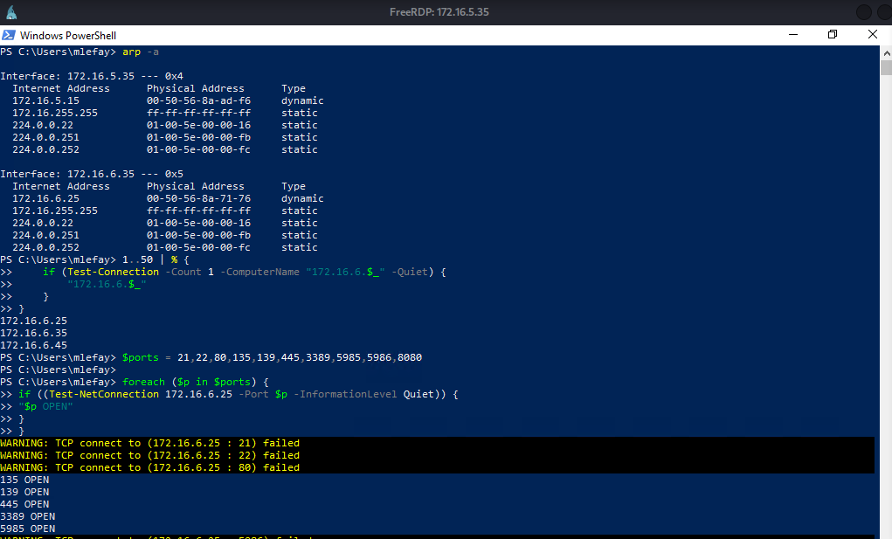
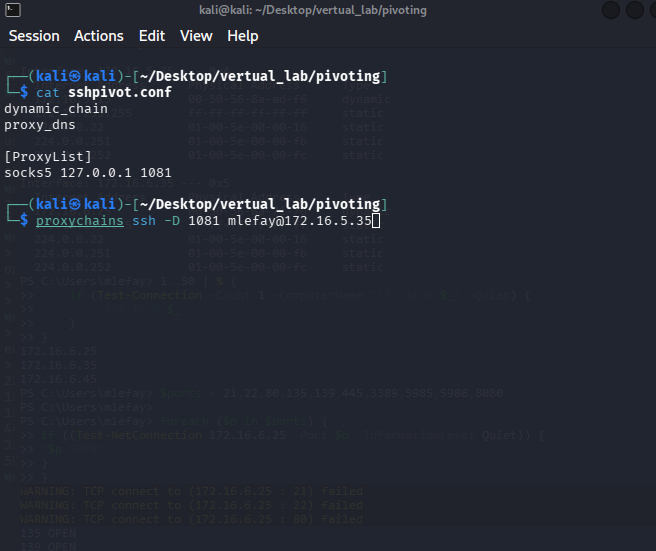
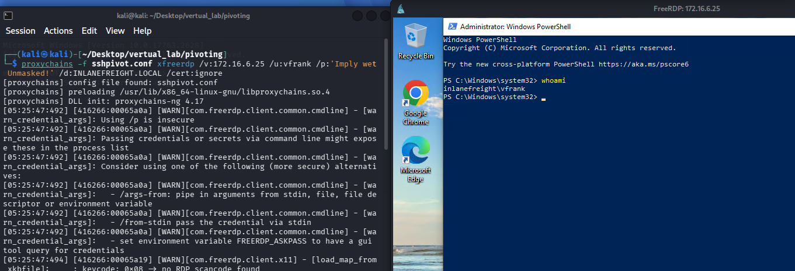

# HTB Academy - Pivoting, Tunneling & Port Forwarding Skills Assessment

> **Disclaimer**
>
> This write-up documents the methodology used to solve the HTB Academy Skills Assessment. It intentionally omits flags and challenge answers while focusing on the technical concepts and techniques practiced during the lab.

---

# Overview

The objective of this lab was to pivot through multiple internal networks starting from an exposed web shell.

The assessment covered:

- Initial foothold through a web shell
- Internal network enumeration
- SSH Dynamic Port Forwarding
- SOCKS Proxy Creation
- Proxychains
- Credential Discovery
- Lateral Movement
- LSASS Credential Extraction
- Nested Pivoting
- Remote Desktop over SOCKS

---

# Lab Information

| Item | Value |
|------|-------|
| Platform | HTB Academy |
| Module | Pivoting, Tunneling & Port Forwarding |
| Environment | Multi-segment Internal Network |
| Operating Systems | Linux & Windows |
| Techniques | Pivoting, SSH, SOCKS, Proxychains, RDP, LSASS |

---

# Network Overview

The attack path followed the network below.


```text
                 Kali
             10.10.14.97
                   │
          SSH -D 9050 (SOCKS)
                   │
     ┌─────────────────────────┐
     │ Pivot Host              │
     │10.129.74.17             │
     │172.16.5.15              │
     └─────────────────────────┘
                   │
          Internal Network
                   │
        ┌───────────────────┐
        │172.16.5.35         │
        │SSH/RDP/SMB/WinRM   │
        └───────────────────┘
                   │
         SSH -D 1081 (Nested)
                   │
        ─────────────────────────
             172.16.6.0/24
        ─────────────────────────
        │           │          │
 172.16.6.25   172.16.6.35 172.16.6.45
```

---

# Step 1 - Initial Foothold

The target exposed the following services.

```text
22/tcp open  ssh
80/tcp open  http
```

Browsing the HTTP service revealed a pre-existing web shell.

The web shell was used to perform local enumeration of the Linux host.



---

# Step 2 - Credential Enumeration

During filesystem enumeration, an SSH private key belonging to the **webadmin** user was discovered.



The private key permissions were corrected before use.

```bash
chmod 600 id_rsa
```

SSH Dynamic Port Forwarding was then established.

```bash
ssh -i id_rsa -D 9050 webadmin@<Pivot-IP>
```

This created a local SOCKS proxy that allowed tools running on Kali to access networks reachable from the pivot host.



---

# Step 3 - Internal Network Enumeration

The pivot host contained a second network interface.

```text
172.16.5.15/16
```

Using local enumeration commands such as:

- arp -a
- ip addr
- ping

another internal Windows host was identified.

```text
172.16.5.35
```

Port enumeration revealed:

```text
22
135
139
445
3389
5985
```

These services indicated that Remote Desktop and WinRM were available.



---

# Step 4 - Credential Discovery

During enumeration, valid user credentials were discovered.

These credentials allowed authentication to the Windows workstation using Remote Desktop through the SOCKS tunnel.



---

# Step 5 - Credential Extraction

After obtaining access to the Windows workstation, an LSASS memory dump was analyzed offline.

The dump file was processed using **pypykatz**.

```bash
pypykatz lsa minidump lsass.dmp
```



The analysis revealed another valid domain credential which would later be used to access a deeper internal network.



---

# Step 6 - Second Internal Network

Additional enumeration revealed another subnet.

```text
172.16.6.0/24
```

Reachable hosts included:

```text
172.16.6.25
172.16.6.35
172.16.6.45
```



---

# Step 7 - Nested Pivot

Instead of using only the first SOCKS proxy, a second SSH Dynamic Port Forwarding tunnel was created from the first internal Linux host.

```bash
proxychains ssh -D 1081 mlefay@172.16.5.35
```

Proxychains was updated to use the new SOCKS proxy.

```text
dynamic_chain
proxy_dns

[ProxyList]
socks5 127.0.0.1 1081
```

This produced a Nested Pivot architecture, allowing traffic to traverse multiple internal networks.



---

# Step 8 - Lateral Movement

Using the credentials recovered from the LSASS dump, Remote Desktop access was established through the nested tunnel.

Example:

```bash
proxychains -f sshpivot.conf xfreerdp \
/v:172.16.6.25 \
/u:vfrank \
/p:'********' \
/d:INLANEFREIGHT.LOCAL \
/cert:ignore
```

This confirmed successful multi-hop pivoting into the deeper internal subnet.



---

# Tools Used

- Nmap
- SSH
- Proxychains
- xfreerdp
- pypykatz
- Bash
- Windows Remote Desktop

---

# Skills Demonstrated

Throughout this assessment I practiced:

- Web Shell Enumeration
- Linux Host Enumeration
- SSH Key Authentication
- SSH Dynamic Port Forwarding
- SOCKS Proxy Configuration
- Proxychains
- Internal Network Discovery
- Credential Hunting
- Remote Desktop Pivoting
- LSASS Memory Analysis
- Credential Extraction
- Nested Pivoting
- Multi-hop Pivoting
- Lateral Movement

---

# Key Takeaways

This lab demonstrates how a single foothold can be leveraged to progressively access segmented enterprise networks.

The most valuable concepts practiced during this assessment include:

- Pivoting through multiple internal networks.
- Creating SOCKS tunnels using SSH Dynamic Port Forwarding.
- Chaining multiple pivots together using Nested Pivoting.
- Combining credential discovery with lateral movement.
- Mapping internal network topology during an engagement.
